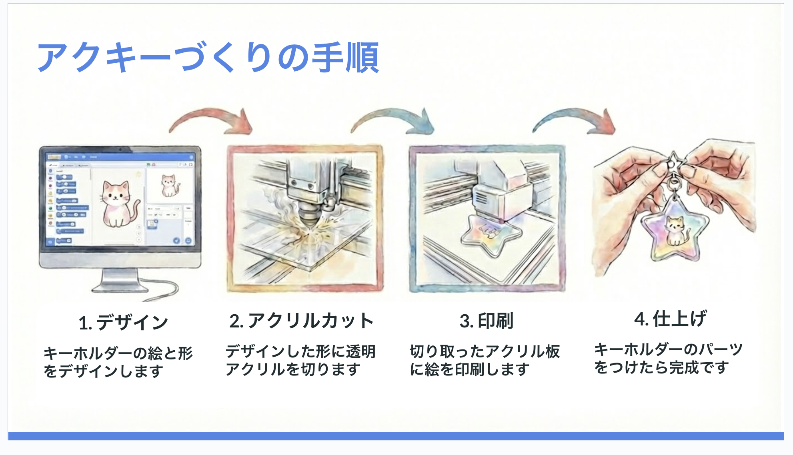

# アクキーデザイナー

アクキーに印刷する絵と形のデータを作るツールです。

## アクキーづくりの手順

### 1. デザイン
Scratchでキーホルダーの絵と形をデザインします。
ScratchでSVGデータを作る「アクキーデザイナー」を利用します

[アクキーデザイナーを開く](https://xcratch.github.io/editor/#https://tukumanalab.github.io/ackey-designer/tools/ackey-designer.sb3)

### 2. アクリルカット
デザインした形に透明アクリルを切ります。
アクキーデザイナーで作成したSVGデータをレーザーカッターに読み込んで切ります。

### 3. 印刷
切り取ったアクリル板に絵を印刷します。
アクキーデザイナーで作成したPDFデータをUVプリンターで印刷します。

### 4. 仕上げ
キーホルダーのパーツをつけたら完成です

## マニュアル

詳しい使い方は[こちら](https://docs.google.com/presentation/d/1gpsUW4CHVBvkp6Iv8Qhgi1x6aVzAoYRQtd1E_Dz8nz8/edit?usp=sharing)をご覧ください。
